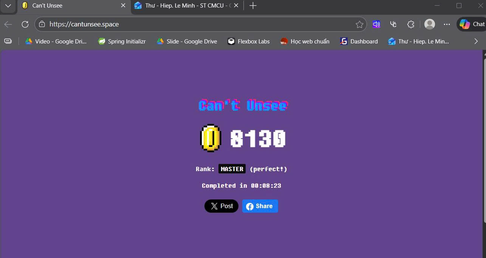

# SOFT4003

Báo cáo Bài tập Kiểm thử phần mềm

- Thông tin cá nhân : 
  + **Họ và tên:** Lê Minh Hiệp
  + **Mã sinh viên:** BIT230152
  + **Lớp:** SOFT5
  + **Môn học:** Kiểm thử phần mềm

## Tuần 1: 5/1/2026 - 11/1/2026 :

1. Hoàn thành Bài tập thực hành 1: Cantunsee; Điểm số: 8130;
  - 

2. Hoàn thành Bài tập thực hành 2: Student Analyzer - Unit Test with JUnit

  2.1. Mô tả
  
    - Chương trình phân tích điểm số học sinh:
    - Đếm số học sinh đạt loại Giỏi (>= 8.0)
    - Tính điểm trung bình các điểm hợp lệ (0–10)
    - Dữ liệu không hợp lệ (<0 hoặc >10) sẽ bị bỏ qua.

  2.2. Công nghệ
  
    - Java 21
    - Maven
    - JUnit 5

  2.3. Cấu trúc thư mục:
  
    unit-test/
    ├── src/main/java/analyzer
    ├── src/test/java/analyzer
    └── pom.xml

## Tuần 2: 12/1/2026 - 18/1/2026:

1. Hoàn thành Bài tập thực hành 3: Kiểm thử tự động End-to-End với Cypress
   
  1.1. Công nghệ.

    - Node.js
    - Cypress
    - Trang web kiểm thử: https://www.saucedemo.com

  1.2. Các kịch bản kiểm thử
  
    - Kịch bản 1: Kiểm tra đăng nhập thành công
      - Truy cập trang https://www.saucedemo.com
      - Nhập thông tin hợp lệ:
        - Username: `standard_user`
        - Password: `secret_sauce`
      - Nhấn nút Login
      - Xác minh URL chuyển sang `/inventory.html`
    
    - Kịch bản 2: Kiểm tra đăng nhập thất bại
      - Truy cập trang https://www.saucedemo.com
      - Nhập thông tin không hợp lệ
      - Nhấn nút Login
      - Xác minh hệ thống hiển thị thông báo lỗi tương ứng

    - Kịch bản 3: Kiểm tra thêm sản phẩm vào giỏ hàng
      - Đăng nhập thành công
      - Nhấn nút “Add to cart” cho sản phẩm đầu tiên
      - Xác minh số lượng sản phẩm trong giỏ là 1

    - Kịch bản 4: Kiểm tra xóa sản phẩm khỏi giỏ hàng
      - Thêm sản phẩm vào giỏ hàng
      - Nhấn “Remove”
      - Xác minh biểu tượng giỏ hàng không còn hiển thị

    - Kịch bản 5: Kiểm tra quy trình thanh toán
      - Đăng nhập, thêm sản phẩm, vào trang giỏ hàng
      - Điền thông tin checkout (First Name, Last Name, Zip Code)
      - Nhấn Continue
      - Xác minh URL chuyển sang trang xác nhận thanh toán (`/checkout-step-two.html`)
  
  1.3. Cấu trúc thư mục

      cypress-exercise
      ├── cypress/
      │ ├── e2e/
      │ │ ├── login_spec.cy.js
      │ │ └── cart_spec.cy.js
      │ ├── fixtures/
      │ └── support/
      ├── node_modules/
      ├── cypress.config.js
      ├── package.json
      └── package-lock.json

    
